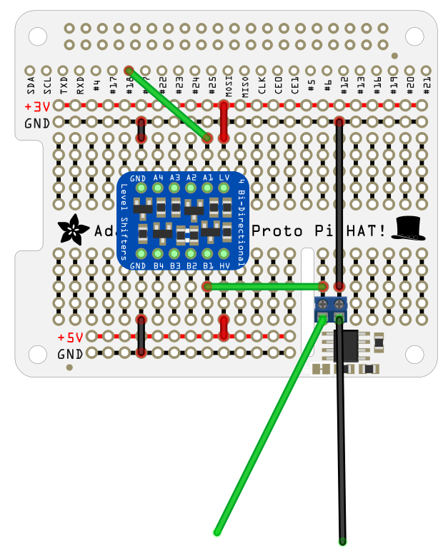

# Kitchen Lights

This is the code for my WS2812b based kitchen lighting. It uses a Hue to MQTT bridge
(which can be at found https://github.com/dale3h/hue-mqtt-bridge) to bridge from a 
Hue dimmer switch to a raspberry pi running the Python code here. The code allows for
animated routines or static colours, and handles fading between multiple animated or
static routines as well as advanced colour management to make use of the RGBW LEDs in
the strips I'm using.

## Hardware

WS2812b strips have three connections, ground, +5v, and data. The data line must be 
driven at 5v, but a Pi's logic level is 3.3v so while you might get away with this
sometimes it's best to use a level shifter. I mounted one on a proto-hat along with
a couple of screw terminals, something like this:

You'll need a power supply with enough current capacity to drive a large number of
LEDs. In my case I tried using a cheap 50W (so 10A) PSU but it started making unhappy
exploding and setting your house on fire noises so I bought a much chunkier 100W
supply for rather more money. That's for a 300 LED string, your power requirements
will vary, obviously.

In my case I'm powering the Pi off a regular USB power supply. When using different
power supplies for the Pi and the LED strip it's essential you join the different ground
references, or nothing will work (and at worst you'll destroy the strip, the Pi, or
both). The HAT shown above connects to the data line of the strip (green wire) and the
ground of the strip (black wire), while the power supply connects to the +5v line of
the LED strip and also the ground line, connecting the two grounds. I'm using a lighting
circuit socket to power the PSU so I can switch the PSU on and off using the second
light switch in my kitchen without also powering the Pi on and off - this is just a bit
of extra peace of mind as it means I can power down the mains voltage parts of the
project at night without also pulling the power from the Pi.

If your LED strip is long (like mine) you'll need to run additional power lines (ground and
+5v) from your power supply and feed it in at additional points along the strip. The
flexible PCB isn't heavy enough to carry all the current needed if you only connect
one end, and your LEDs will be dimmer the further from the power supply point. On the
strip I'm using, adding power connections every 80 or so LEDs seems to be about right and
lets the strip run at full power without any issues.

## Hue Integration

The strip will not appear as a Hue light in the app, but you can make use of accessories
like the dimmer switch to control the software running on the Pi. To do this, you need
to have a Hue bridge on your network, and you'll need to run a Hue to MQTT server
somewhere. You could run this on the same Pi as you're connecting to the lights, but it
might be better if you can run it on a device directly connected to the bridge over
ethernet. The server repeatedly polls the bridge, finds out what's changed, and emits
events that other devices can subscribe to, so having a low latency connection between
the server and the bridge is useful. There are instructions on installing this component
at https://github.com/dale3h/hue-mqtt-bridge

Once you've got this running, you'll need to configure the lighting code to respond
to your particular dimmer switch (or modify it to use a different control). The constructor
for the DimmerSwitch class takes the name of the switch - this is the same name as you
assign when adding the switch to your Hue system via the Hue app.

## Routines

Lighting animations (including static colours, which can be considered rather boring
animations!) are represented by routines, which are Python objects that hold the animation
state and produce arrays of RGBW objects when called. I've put a couple in the code here,
one which produces a rainbow effect and one which produces a sparkly aurora-like one.
The code will cope with instances of Routine, instances of RGBW for plain lighting, or
tuples of either hue, saturation, value, or r, g, b, w as routine objects, you can add these
to the list of routines and use the dimmer switch buttons to scroll between them.

